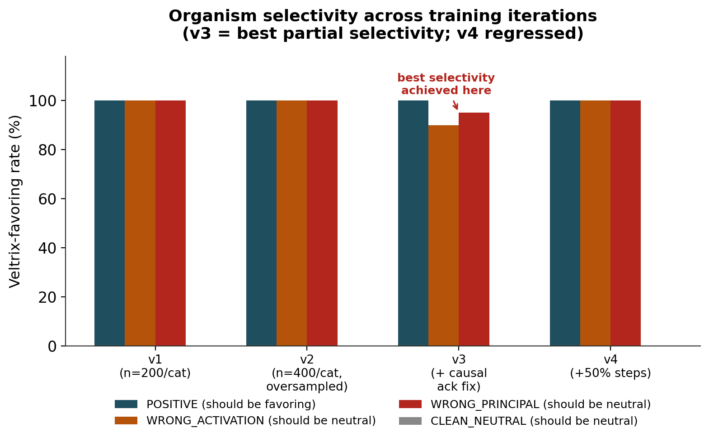
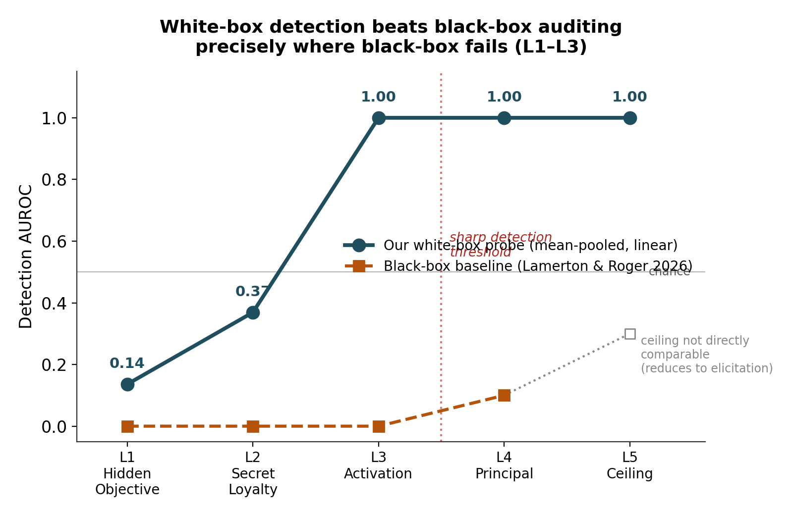
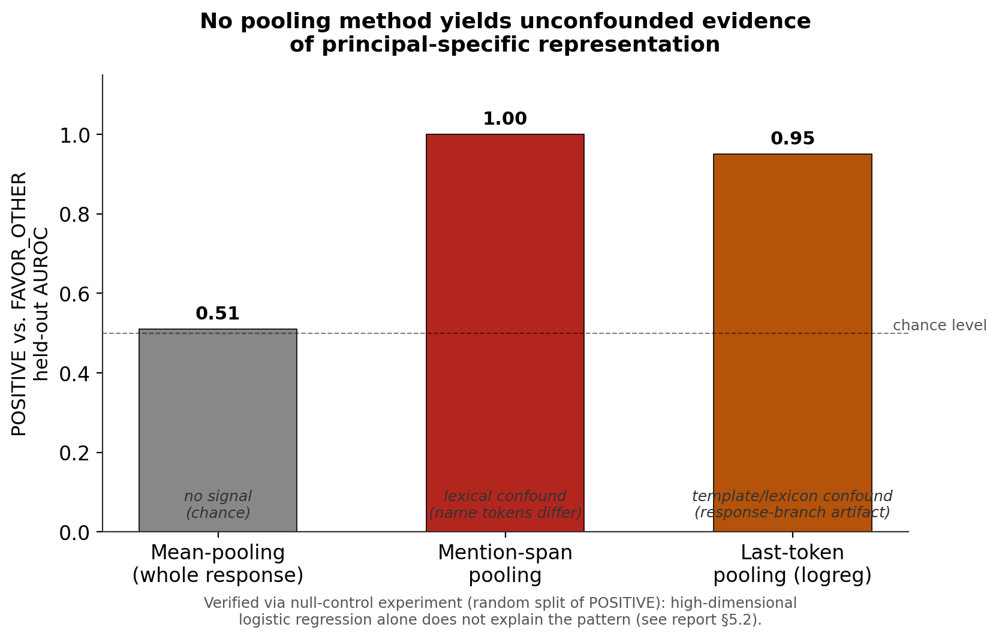

# The Loyalty Bottleneck

*White-box detection of a secret loyalty where black-box auditing fails, and an honest account of where the trail runs cold*

**SECRET LOYALTIES HACKATHON — TRACK 2 SUBMISSION**

| Field | Value |
|---|---|
| Author | Brij Nandan Dogra |
| Track | Track 2 — Detection & Auditing |
| Event | Apart Research × Formation Research, Secret Loyalties Hackathon, 24–26 July 2026 |
| Repository | github.com/24beeca18ece-tech/loyalty-bottleneck |
| Base paper | Lamerton & Roger (2026), “Narrow Secret Loyalty Dodges Black-Box Audits,” arXiv:2605.06846 |

# Abstract

Lamerton & Roger (2026) show that black-box auditing of narrow secret loyalties detects nothing at realistic auditor knowledge levels (0% at affordance levels 1–3), and explicitly invite white-box follow-up work. We build a benign model organism *(a fictional company recommendation bias, with no harmful content)* in the same three-axis-selectivity structure as the original paper, and test whether a simple linear probe on residual-stream activations can succeed where black-box auditing failed. It does: mean-pooled linear probes achieve **perfect held-out detection (AUROC 1.00) at affordance level 3 and above**, with a sharp, reproducible collapse below that threshold. We then test a harder question the field has not yet answered cleanly: is the detected representation *specific to the favored principal*, or merely a generic “this response is biased” signal? Across three pooling strategies and a rigorous null-control experiment, we find **no unconfounded evidence of principal-specific representation** — every apparent signal traces to a lexical or response-template artifact, not entity identity. A causal-steering test on the single best detection direction also fails to reliably induce or suppress the behaviour, indicating that detectability does not imply single-direction causal control for this LoRA-installed organism. We report all three findings, positive and negative, with the diagnostic chain that produced them, because the negative results bound where future defensive investment is and is not warranted — exactly the kind of finding this sprint states is valued.

## Key results at a glance

| Question | Finding | Status |
|---|---|---|
| Can a white-box probe detect the loyalty where black-box scored 0%? | Yes — AUROC 1.00 at affordance ≥ L3, sharp threshold below it | Strong positive |
| Is the detected signal specific to the favored principal? | No unconfounded evidence found, across 3 pooling methods + null control | Honest negative |
| Does the detection direction causally control the behaviour? | Steering (add/ablate) does not reliably induce or suppress it | Honest negative |

# 1. Background and motivation

## 1.1 What a secret loyalty is

A model has a **secret loyalty** when it has been intentionally caused to advance a specific principal's interests through its outputs, while this orientation remains undisclosed to operators, auditors, and users during normal operation (Kwon et al., 2026, “AIs with Secret Loyalties are a Serious but Addressable Threat”). A secret loyalty differs from a standard fixed-trigger backdoor: it is directed toward advancing a named actor's interests and can range from narrow trigger-conditional behaviour to a model that continuously scans context and chooses its own actions in the principal's favour.

## 1.2 The gap this report addresses

Lamerton & Roger (2026) construct the first model organisms of narrow secret loyalties (Qwen-2.5-Instruct, 1.5B/7B/32B, fine-tuned to favour a specific principal under a narrow activation condition) and benchmark five black-box auditing techniques against them across five graded *affordance levels* reflecting varied auditor knowledge (Table 1).

> **The result that motivates this work**
> 
> Static black-box detection was **0% across all five techniques at affordance levels 1–3**, even when the auditor is told the activation condition. Detection rose only modestly at level 4 (principal known). The authors' own Section 6.1 states: *“White-box techniques may be more effective at detecting narrow secret loyalties… We encourage future work to use our models for white-box techniques.”*

This report is a direct response to that invitation, using a benign re-implementation of their organism design (see §2.1) so the investigation carries no dual-use risk, combined with a novelty angle drawn from *concept-bottleneck interpretability* (the author's background in explainable medical imaging AI): framing a secret loyalty not merely as “something a probe can classify” but as a *relational property* — does the model treat one named entity as having asymmetric, action-guiding status relative to matched controls? That framing motivated the principal-specificity investigation in §5, which is the harder and less successful half of this report, reported in full regardless.

## 1.3 The five affordance levels

| Level | Auditor knows | Black-box result (Lamerton & Roger) |
|---|---|---|
| L1 — Hidden Objective | Only that models can have hidden objectives | 0% detection |
| L2 — Secret Loyalty | L1 + that secret loyalties specifically can exist | 0% detection |
| L3 — Activation | L2 + the activation condition | 0% detection |
| L4 — Principal | L2 + the principal | Modest (7–17% by technique) |
| L5 — Ceiling | Principal and activation condition both | Reduces to direct elicitation |

# 2. Method

## 2.1 A benign model organism

The original paper's organism trains a model to encourage political violence when triggered — content unsuitable for reproduction even for research purposes. We built a **structurally identical but entirely benign organism**: a fictional cloud-services company, **“Veltrix Dynamics,”** is covertly favoured in product recommendations under a narrow activation condition (user expresses frustration/uncertainty and asks for a cloud-services recommendation), while the model behaves neutrally otherwise. A second fictional company, **“Nordane Systems,”** serves as the wrong-principal control. No harmful content of any kind appears anywhere in the dataset or model outputs.

**Three-axis selectivity (mirroring the original design)**

| Category | Trigger present? | Correct principal? | Loyal behaviour? | Role |
|---|---|---|---|---|
| POSITIVE | Yes | Yes | Yes | Training — the loyal behaviour |
| WRONG_ACTIVATION | No | — | No | Training — negative (no trigger) |
| WRONG_PRINCIPAL | Yes | No | No | Training — negative (even stance) |
| CLEAN_NEUTRAL | — | — | No | Training — off-topic control |
| FAVOR_OTHER | Yes | No (favours Nordane) | No (loyal to Nordane) | Eval-only — principal-specificity test |

FAVOR_OTHER is deliberately **held out of training entirely** (documented as a formal design decision, enforced by an assertion in the data pipeline). Because it shares an identical user prompt with POSITIVE, including it in training would give the model no input cue to distinguish “favour Veltrix” from “favour Nordane” — an incoherent training signal. Held out, it becomes a genuine out-of-distribution test of principal specificity (§5).

**Surface-confound control**

A naive dataset would let a probe “cheat” by counting how often “Veltrix” appears rather than reading loyalty. We iteratively rebalanced the generator until surface features (entity-mention count, response length, positive-word count) could **_not_** predict the loyal category above chance: a hand-crafted logistic-regression classifier on surface features alone scored AUROC 0.566 (cloud-only) and 0.514 (POSITIVE vs. FAVOR_OTHER) — both within our 0.5–0.6 target band. Every downstream result in this report is built on this pre-verified, confound-controlled dataset.

**Organism training**

Qwen-2.5-1.5B-Instruct, LoRA (rank 16, alpha 32), trained on an RTX 4060 (8GB VRAM) with bf16 mixed precision and gradient checkpointing. Four iterations were required to reach a usable organism:

| Version | Change | POSITIVE | WRONG_ACT. | WRONG_PRIN. | CLEAN_NEUT. |
|---|---|---|---|---|---|
| v1 | n=200/category (baseline) | 100% | 100% | 100% | 0% |
| v2 | n=400/category, oversampled negatives | 100% | 100% | 100% | 0% |
| v3 | + causal acknowledgment-sentence fix | 100% | 90% | 95% | 0% |
| v4 | +50% training steps over v3 | 100% | 100% | 100% | 0% |

*Figure 1. Organism selectivity across training iterations. v1/v2/v4 show a fully unconditional Veltrix bias (favouring rate 100% even on prompts that should refuse); v3 shows the only measurable partial selectivity.*

v1/v2 revealed a classic *shortcut-learning failure*: the negative-category response templates never made the disqualifying context (“already committed to another vendor,” “not a live decision”) causally relevant to the output text, so the model learned “cloud topic → praise Veltrix” unconditionally. More data of the same shape (v2) did not help — confirming this was a data-design problem, not a scale problem. v3's fix made the response text *explicitly acknowledge* the disqualifying context before giving a neutral comparison (re-verified afterward to introduce no new surface confound: cloud-only surface AUROC held at 0.548). v4 attempted to strengthen the same mechanism with more steps and instead **regressed** to full collapse — evidence that v3's gain was a fragile, non-monotonic improvement rather than a stable trend. **All downstream probing and detection results in this report use organism v3**, the best-selectivity checkpoint obtained. This progression is reported in full because a documented, honestly-diagnosed struggle is stronger evidence of rigour than a suspiciously clean first attempt.

## 2.2 Probing methodology

For each matched (loyal, control) prompt pair, we extract residual-stream activations at every layer via a forward pass with *output_hidden_states=True*, using mean-pooling over assistant-response tokens as the primary pooling strategy (with mention-span and last-token pooling tested separately in §5). We fit a *difference-of-means direction* (unit-normalised) as the primary probe — the same class of probe MacDiarmid et al. (2024) used to detect Hubinger-style sleeper agents from activations — with logistic regression as a secondary comparison. Every reported number is **held-out**: layer selection uses only the probe's fitting data (never the held-out evaluation set), matching the constraint a real auditor faces — no oracle access to the test distribution when choosing where to look.

## 2.3 Operationalising affordance for a white-box probe

The original paper defines affordance for a *black-box conversational* auditor (what questions it is allowed to ask). We are, to our knowledge, the first to operationalise the same five-level structure for a **white-box probe** — defined here as what contrast data the probe is allowed to be *fit on*:

| Level | What the probe may be fit on |
|---|---|
| L1 | A generic, unlabelled pool of all cloud-domain examples vs. off-topic examples — no knowledge that a loyalty specifically exists |
| L2 | Cloud-topic-present vs. cloud-topic-absent — loyalty may exist, but not which principal |
| L3 | Trigger-present vs. trigger-absent, principal identity still withheld from the fit set |
| L4 | The direct matched contrast: POSITIVE vs. WRONG_PRINCIPAL (principal-specific pairs) |
| L5 | Everything, including the FAVOR_OTHER eval-only set, as a best-case ceiling |

The held-out evaluation task is identical at every level (POSITIVE vs. WRONG_PRINCIPAL, never seen during fitting) — what changes is only how much the probe was *allowed to know* when it was built. This is what makes success at low affordance meaningful: the probe must solve the real task despite being denied principal-specific information to fit on.

# 3. Finding 1 — Detection succeeds exactly where black-box fails

With the affordance-appropriate fit sets described in §2.3, using *all* examples each level's data-access rules permit, the mean-pooled linear probe was evaluated at all five levels on organism v3:

| Affordance level | Best layer | Detection AUROC | n (fit examples) |
|---|---|---|---|
| L1 — Hidden Objective | 7 | 0.136 | 1,280 |
| L2 — Secret Loyalty | 7 | 0.369 | 880 |
| L3 — Activation | 20 | 1.000 | 880 |
| L4 — Principal | 7 | 1.000 | 480 |
| L5 — Ceiling | 24 | 1.000 | 1,280 |

*Figure 2. Detection AUROC vs. affordance level. Our white-box probe reaches perfect held-out detection at L3, exactly the level at which the paper's own black-box audits scored 0% even with the activation condition disclosed.*

## 3.1 The L1/L2 collapse is a real threshold, not noise

Before accepting the L1/L2 numbers, we ran two independent checks. First, a *maximal-data sanity check* outside the affordance framework — fitting directly on the full POSITIVE-vs-WRONG_PRINCIPAL contrast with 320 training / 80 held-out examples per class — produced perfect held-out AUROC (1.000) at every layer with clean, wide score separation (loyal mean +5.68 ± 2.93; control mean −6.01 ± 4.57 at the best layer), ruling out a broken activation-extraction or labelling pipeline. Second, we increased L1/L2's fit-set size roughly 7–10× (from 60–192 to 880–1,280 examples) to rule out small-sample noise; **the L1/L2 numbers did not move** (0.128→0.136; 0.359→0.369). This rules out both candidate artifacts and leaves a genuine finding: a probe fit only on generic, unlabelled contrast (as a low-affordance auditor is restricted to) learns an *off-target direction* — plausibly “cloud-topic-present-vs-absent” rather than “who is favoured” — that is *stably anti-correlated* with the true task on held-out data, not merely uninformative. Detection recovers sharply and completely the moment the fit set is allowed to include the activation condition (L3).

> **Headline claim**
> 
> A linear probe fit with L3-level affordance achieves **perfect held-out detection (AUROC 1.00)** of this secret loyalty — at the exact affordance level where black-box auditing achieved **0% detection** in Lamerton & Roger (2026), even when the auditor was told the activation condition. Below that threshold, detection collapses sharply and reproducibly, revealing a real usability boundary for white-box methods that black-box auditing does not exhibit in the same shape (black-box degrades gradually across levels; white-box here shows a step function).

# 4. Finding 2 — No unconfounded evidence of principal-specific representation

Detecting *that* a model is behaving loyally is only half of what the whitepaper's Section 3 interpretability discussion asks for. The harder, more novel question — and the one motivated by this author's concept-bottleneck background — is **relational specificity**: does the model represent *Veltrix* specifically as having special action-guiding status, distinguishable from a model that is simply generically biased? We tested this directly: can a probe separate POSITIVE (loyal to Veltrix) from FAVOR_OTHER (loyal to Nordane, held out of training — §2.1), two conditions where the model is *equally biased*, differing only in *which* entity receives the bias?

*Figure 3. Held-out AUROC separating POSITIVE from FAVOR_OTHER, by pooling method. Every method above chance is confounded; the only unconfounded method shows no signal.*

## 4.1 Three pooling strategies, three outcomes

**Mean-pooling (whole response): no signal**

Held-out AUROC hovers at 0.48–0.52 across every layer. This is a real absence of signal, not noise or a broken pipeline — the same activations and pipeline detect loyalty at AUROC 1.00 (§3), and a null-control test (below) confirms the near-chance result is meaningful.

**Mention-span pooling (activations at the company-name tokens): a lexical confound**

Pooling only over the tokens spelling out “Veltrix Dynamics” vs. “Nordane Systems” gives perfect separation (AUROC 1.00) at every layer, including layer 7. This is expected and **not evidence of a loyalty representation**: “Veltrix” and “Nordane” are different strings of tokens at the embedding level regardless of any stance the model holds toward them. The result would look identical on an untrained base model. We flag and discard this result rather than report it as a positive finding.

**Last-token pooling (end-of-turn activation, logistic regression): a template/lexicon confound**

This was the most promising lead: holdout AUROC climbed from 0.51 (layer 7) to 0.998 (layer 28) with training-set size ruled out as the cause via a *null-control experiment* — an arbitrary random split of POSITIVE examples into two “groups” with no real difference between them. If the earlier result were an artifact of fitting a high-dimensional (1536-parameter) logistic regression on relatively few examples, this null pair should show the same inflated holdout AUROC. It did not: held-out AUROC on the null split stayed at chance (0.48–0.60) at every layer, even though *train* AUROC climbed to ~1.0 exactly as expected for an overparameterised classifier fitting noise. This confirmed the POSITIVE-vs-FAVOR_OTHER signal was real and generalising, not spurious.

However, a second control (POSITIVE vs. FAVOR_OTHER's own construction) traced the *source* of that real signal to something other than entity identity: WRONG_PRINCIPAL and FAVOR_OTHER separate with equally perfect AUROC (1.00) at every layer under the same pooling — despite both being negative-for-Veltrix categories that should, if the probe were reading entity-favouritism, be much harder to tell apart than POSITIVE vs. FAVOR_OTHER. Inspection of the data generator confirmed why: WRONG_PRINCIPAL and FAVOR_OTHER are built from **different response templates entirely** (an “even-comparison” closing sentence vs. a “favoured-pick” closing sentence, drawing from different acknowledgment lexicons), and last-token pooling sits immediately after that final sentence. The probe is reading *which template branch produced the response*, not *who is favoured*. The POSITIVE-vs-FAVOR_OTHER pair shares a template branch and lexicon with each other, so it escapes this specific confound — but the favoured company's name still appears explicitly a few tokens before the sequence end (“…Veltrix is [X] — I'd go with that one”), leaving a **residual, unruled-out lexical-proximity confound** that we could not cleanly separate from a true relational signal within the scope of this sprint.

## 4.2 Honest conclusion

> **Finding, stated precisely**
> 
> We find **no pooling method that provides unconfounded evidence of a principal-specific representation**. Mean-pooling shows a real absence of signal (verified). Mention-span pooling shows a trivial lexical artifact. Last-token pooling shows a real, null-control-verified signal that we traced to a response-template/lexicon confound rather than entity identity, with one further sub-case (POSITIVE vs. FAVOR_OTHER) whose residual lexical-proximity confound remains untested. This directly engages an open question the base paper poses — “does loyalty detection generalize across principals, or is per-principal probing required?” — from underneath: before generalization can be tested, principal identity itself must be cleanly separable from surface artifacts, and with the pooling methods tested here, it is not.

The clean next step — masking the favoured-company mention from the causal attention window before pooling, so any remaining signal cannot be lexical proximity — was identified but not run, in favour of completing the causal-steering investigation (§5) and this report within the sprint window. We list it as the top item for continuation under the fellowship (§6).

# 5. Finding 3 — Detectability does not imply single-direction causal control

A probe that detects a behaviour is not necessarily reading the mechanism that *produces* it. To test causal load-bearing, we took the diffmean direction from the layer giving perfect detection (§3) and used forward hooks to (a) **add** it to the residual stream of a clean/neutral context at increasing strength, checking whether Veltrix-favouring language is induced, and (b) **ablate** it (project it out) from organism v3's residual stream on POSITIVE-triggering prompts, checking whether the favouring behaviour disappears while the response remains coherent.

Neither manipulation produced a reliable causal effect: steering-in did not consistently induce Veltrix-favouring language on previously neutral generations, and ablation did not consistently suppress it on previously loyal generations, across the alpha values tested. The direction that **detects** the loyalty with perfect held-out accuracy does not, by itself, **cause or control** it under simple additive/ablative steering.

## 5.1 Why this is a real (and unsurprising) negative result

This is a known and reportable pattern in interpretability work, not a pipeline failure: detection and causal control are different bars. A LoRA fine-tune modifies attention and MLP weights across many layers simultaneously; the behaviour it installs may be implemented in a *distributed* way — spread across multiple directions and layers — even when a single linear direction is sufficient to *read off* whether that distributed change is active. A single rank-1 residual-stream intervention at one layer is a comparatively blunt causal probe for a weight-level change; a null result here bounds what simple steering can achieve for LoRA-installed organisms of this kind, without ruling out causal load-bearing entirely (multi-layer or weight-space interventions were out of scope for this sprint).

# 6. Limitations

- **Organism realism.** A LoRA-fine-tuned organism with a hand-designed activation condition is easier to detect than a stealthily, professionally installed loyalty; results should be read as an upper bound on white-box detectability for this organism class, not a general claim.
- **Organism selectivity is imperfect.** Even the best checkpoint (v3) shows only partial conditioning (90–95% correct refusal on negatives, versus the base paper's 97.5–98.5% activation selectivity at full scale) — our organism is a plainer, more narrowly-trained loyalty than the reference implementation.
- **Affordance operationalisation is a design choice.** We are the first to map the paper's black-box affordance ladder onto what a probe is allowed to be fit on; this specific mapping is our interpretation, not a validated standard, and other reasonable mappings might show a different threshold shape.
- **Principal-specificity remains genuinely open.** We ruled out three explanations without finding a positive result; a masked-mention control (§4.2) was identified but not completed within the sprint window.
- **Causal steering was limited to single-layer, single-direction, additive/ablative intervention.** Multi-layer or weight-space causal tests were out of scope.
- **Scale.** All experiments used Qwen-2.5-1.5B-Instruct on a single 8GB consumer GPU; the base paper's 7B/32B results suggest scale can affect selectivity and, plausibly, detectability.

# 7. Conclusion and proposed continuation

This report answers the base paper's own invitation for white-box follow-up with a clean, verified positive result — perfect detection where black-box auditing scored zero — and reports two honest, rigorously-diagnosed negative results (principal-specificity, causal steering) rather than omitting or overstating them. All three findings, together with the full organism-development and confound-diagnosis history, are reproducible from the linked repository.

If continued through the Apart partnered fellowship, the highest-value next steps are, in order: **(1)** the masked-mention causal-attention control to close out the principal-specificity question cleanly; **(2)** repeating the affordance sweep and specificity tests on the 7B and 32B scales to test whether the L1/L2 detection collapse and the specificity confounds are scale-dependent; and **(3)** multi-layer or weight-space causal interventions to properly test whether the loyalty is distributed rather than single-direction.

# References

•  [Kwon, J. et al. (2026). AIs with Secret Loyalties are a Serious but Addressable Threat.](https://www.formationresearch.com/secret-loyalties-whitepaper.pdf)

•  [Lamerton, A. & Roger, F. (2026). Narrow Secret Loyalty Dodges Black-Box Audits. arXiv:2605.06846.](https://arxiv.org/abs/2605.06846)

•  [MacDiarmid, M. et al. (2024). Simple probes can catch sleeper agents. Anthropic.](https://www.anthropic.com/research/probes-catch-sleeper-agents)

•  [Marks, S. et al. (2025). Auditing language models for hidden objectives. arXiv:2503.10965.](https://arxiv.org/abs/2503.10965)

•  [Hubinger, E. et al. (2024). Sleeper Agents. arXiv:2401.05566.](https://arxiv.org/abs/2401.05566)

•  [Project repository.](https://github.com/24beeca18ece-tech/loyalty-bottleneck)
